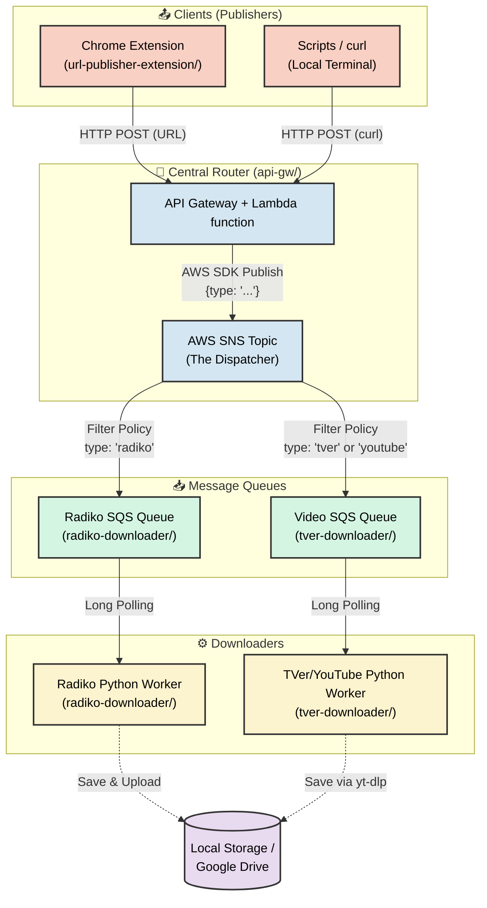

# Serverless Media Downloader ([日本語](./README_ja.md))

This repository contains an automated, event-driven media recording system designed to download streaming media (such as Radiko radio programs and TVer/YouTube videos), stitch them together if necessary, and ultimately save them locally or upload them securely to Google Drive.

It is structured as a monorepo housing several interconnected components:

<details>
<summary><b>System Architecture Diagram</b></summary>



</details>

## 🗂️ Projects

* **[url-publisher-extension](./url-publisher-extension/)**: A Chrome extension that captures URLs from the browser and sends them to the API Gateway.
* **[api-gw](./api-gw/)**: An AWS API Gateway and Lambda function that validates incoming requests and dispatches them as JSON payloads to a central AWS SNS topic. It acts as the traffic router (e.g., routing `radiko.jp` URLs to the Radiko SQS queue, and `tver.jp` or `youtube.com` URLs to the TVer/Video SQS queue).
* **[radiko-downloader](./radiko-downloader/)**: A Dockerized Python worker that continuously polls its dedicated SQS queue for Radiko URLs. It uses `yt-dlp` to download the segments, `ffmpeg` to concatenate them seamlessly, and the Google Drive API to upload the final `.m4a` file. For scheduling recurring recordings via `cron`, see [radiko-downloader/SCHEDULING.md](./radiko-downloader/SCHEDULING.md).
* **[tver-downloader](./tver-downloader/)**: A lightweight Dockerized Python worker that polls its SQS queue for Video (TVer/YouTube) URLs, using `yt-dlp` to download the videos locally.

## ⚙️ General Requirements

To run this project, you need the following infrastructure and tools:
* **Docker & Docker Compose** (Host machine, e.g., Ubuntu/Linux)
* **Terraform** (To automatically provision the required AWS infrastructure)
* **AWS Account** (For SNS Topics, SQS Queues, and IAM Users)
* **Google Account** (Destination for saving Radiko audio files. You can skip this and save locally. A **Google Workspace** account is recommended for avoiding 7-day token expirations.)

---

## 🚀 Setup Instructions

### 1. Provision AWS Resources (Terraform)
This project uses Terraform to automate the creation of the required AWS SNS Topics, SQS Queues, and IAM Worker credentials.

Before running Terraform, you must create a centralized configuration file in the root directory:
```bash
cp terraform.tfvars.example terraform.tfvars
```
Edit the newly created `terraform.tfvars` file and update `aws_region` and the `sns_topic_arn` (which you will get after deploying `api-gw`).

Next, you will need to run Terraform in three separate directories, in this specific order:

1.  **API Gateway (`api-gw/`)**: Creates the main SNS dispatcher topic and publisher credentials.
2.  **Radiko (`radiko-downloader/`)**: Creates the Radiko SQS queue and worker credentials.
3.  **TVer (`tver-downloader/`)**: Creates the TVer/Video SQS queue and worker credentials.

For each directory:
```bash
cd [directory]
terraform init
terraform plan -var-file="../terraform.tfvars"
terraform apply -var-file="../terraform.tfvars"
cd ..
```

Terraform will output the necessary IAM access keys, SQS Queue URLs, and the SNS Topic ARN. Keep these values handy for the `.env` file configuration in Step 3.

> [!NOTE]
> If any outputs (such as the `AWS_SECRET_ACCESS_KEY`) are marked as `<sensitive>` and hidden in your console output, you can reveal the exact values by running:
> ```bash
> terraform output -json
> ```

### 2. Google Drive API Configuration (Radiko Only)
If you do **not** configure Google Drive (by leaving `GDRIVE_FOLDER_ID` empty in step 3), the Radiko worker will automatically skip uploading and instead save the final `.m4a` files locally to your host machine's `/tmp` directory.

If you want to use Google Drive:
1. Go to the Google Cloud Console and enable the **Google Drive API**.
2. Create an **OAuth Consent Screen** (Internal for Workspace users, External for regular users).
3. Create **OAuth Client ID** credentials (Desktop App) and download the JSON.
4. Run the local authentication script to generate your `token.json` file. Place `token.json` in the `radiko/` folder. *(Note: Do not include `client_secret.json` in the runtime environment).*

### 3. Configure Docker Environment Variables
You must create a `.env` file in **both** the `radiko-downloader/` and `tver-downloader/` directories. Start by copying the examples:

```bash
cp radiko-downloader/.env.example radiko-downloader/.env
cp tver-downloader/.env.example tver-downloader/.env
```

Edit both `.env` files and fill in your newly provisioned AWS credentials, SQS Queue URLs, and Google Drive folder ID (if applicable).

#### Post-Processing Hooks (Optional)
If you run external scripts that need to be triggered after a download finishes, you can set `CREATE_READY_FILE=true` in either `.env` file. This tells the worker to generate a `<media_file_name>.ready` file inside `/app/downloads` immediately after the media file is fully processed and `chowned`.

<details>
<summary><b>Example: Debian Systemd Watcher</b></summary>

You can set up a lightweight background service on your Debian/Ubuntu host that watches the downloads directory for `.ready` files using `inotify-tools`, and triggers custom processing (like moving files, encoding audio, or scanning Plex).

**1. Install `inotify-tools`:**
```bash
sudo apt update && sudo apt install -y inotify-tools
```

**2. Create the processor script (`/usr/local/bin/process_downloads.sh`):**
```bash
#!/bin/bash
DOWNLOAD_DIR="/path/to/media-downloader/downloads"

inotifywait -m -e create --format '%w%f' "$DOWNLOAD_DIR" | while read NEW_FILE
do
    if [[ "$NEW_FILE" == *.ready ]]; then
        MEDIA_FILE="${NEW_FILE%.ready}"
        if [ -f "$MEDIA_FILE" ]; then
            echo "[$(date)] Processing: $MEDIA_FILE"
            
            # --- ADD YOUR CUSTOM COMMANDS HERE ---
            # e.g., mv "$MEDIA_FILE" /mnt/nas/
            
            rm -f "$NEW_FILE"
        fi
    fi
done
```
*(Make it executable with `sudo chmod +x /usr/local/bin/process_downloads.sh`)*

**3. Create the Systemd Service (`/etc/systemd/system/media-processor.service`):**
```ini
[Unit]
Description=Media Downloader Ready File Processor

[Service]
Type=simple
User=your_linux_username
ExecStart=/usr/local/bin/process_downloads.sh
Restart=on-failure
RestartSec=5

[Install]
WantedBy=multi-user.target
```

Enable and start with: `sudo systemctl daemon-reload && sudo systemctl enable --now media-processor`
</details>

### 4. Deploy the Workers
You can start the workers independently by navigating to their directories:

**Radiko Worker:**
```bash
cd radiko-downloader
docker compose up -d --build
```

**Video (TVer/YouTube) Worker:**
```bash
cd ../tver-downloader
docker compose up -d --build
```
The containers will now run silently in the background, polling their respective SQS queues for recording tasks.

### 5. Deploy & Configure the Chrome Extension
The included Chrome Extension is the primary way to quickly capture and dispatch Media URLs. 

> **💡 Note:** This extension is built as a general-purpose HTTP POST client. While pre-configured instructions are provided for this project's dispatcher, you can point it at **any** API Gateway or compatible webhook that accepts `{"urls": ["..."]}` and an `x-api-key` header.

Since it is not published to the Chrome Web Store, you must load it locally.

**Installation:**
1. Open Google Chrome.
2. Navigate to `chrome://extensions/` in your address bar.
3. Turn on the **Developer mode** toggle in the top-right corner.
4. Click the **Load unpacked** button in the top-left menu.
5. Select the `url-publisher-extension` folder located inside this project directory.
6. The "URL Publisher" extension should now appear. Pin it to your toolbar for easy access.

**Configuration:**
Before you can publish URLs, you must point the extension to your AWS backend.
1. Click the URL Publisher extension icon in your Chrome toolbar.
2. Click the **⚙️ Settings** gear icon in the top right corner of the extension popup.
3. Fill in the fields using the outputs from the `api-gw` Terraform deployment in Step 1:
   - **API Gateway Endpoint URL**: Paste the `api_endpoint` URL.
   - **API Key**: Paste the `api_key` string.
4. Click **Save Settings**.
5. You are ready to go! Navigate to a supported video/radio page, open the extension, and click **Publish**.

### 6. Triggering & Scheduling Recordings (HTTP API)
While the primary method of dispatching URLs is via the Chrome extension interfacing with the API Gateway, you can still trigger recordings manually or schedule them via `cron` using standard HTTP POST requests. 

This is the recommended approach as it avoids needing to store any AWS IAM credentials on your local machine.

You will need two values from your `api-gw` Terraform output:
1. `api_endpoint` (Terraform output)
2. `api_key` (Terraform output)

**Manual Trigger (Radiko Example):**
```bash
curl -X POST "https://YOUR_API_ENDPOINT/prod/publish" \
  -H "Content-Type: application/json" \
  -H "x-api-key: YOUR_API_KEY" \
  -d '{"urls": ["https://radiko.jp/#!/ts/FMJ/20260301130000"]}'
```

**Manual Trigger (TVer Example):**
```bash
curl -X POST "https://YOUR_API_ENDPOINT/prod/publish" \
  -H "Content-Type: application/json" \
  -H "x-api-key: YOUR_API_KEY" \
  -d '{"urls": ["https://tver.jp/episodes/ex4mple"]}'
```

#### Automating with Cron
For automatic, recurring recordings (like a weekly radio show), simply add the exact `curl` command above to your system's `crontab`.

For Radiko specifically, the included [`radiko-downloader/SCHEDULING.md`](./radiko-downloader/SCHEDULING.md) covers a dedicated helper script (`radiko-download.py`) that simplifies building cron entries for multi-segment programs.

**Example Cron Job (Runs every Sunday at 12:55 PM):**
```bash
55 12 * * 0 curl -X POST "https://YOUR_API_ENDPOINT/prod/publish" \
  -H "Content-Type: application/json" \
  -H "x-api-key: YOUR_API_KEY" \
  -d '{"urls": ["https://radiko.jp/#!/ts/FMJ/20260301130000"]}' >> /tmp/radiko-cron.log 2>&1
```

---

## 🎛️ Environment Configuration

Both `radiko/.env` and `tver/.env` share a similar structure, providing robust configuration options:

| Variable | Required | Description |
| :--- | :---: | :--- |
| `AWS_ACCESS_KEY_ID` | Yes | The IAM access key for the specific downloader worker (from Terraform). |
| `AWS_SECRET_ACCESS_KEY`| Yes | The IAM secret key for the specific downloader worker. |
| `AWS_REGION` | No | Defaults to `ap-northeast-1`. |
| `SQS_QUEUE_URL` | Yes | The absolute URL of the SQS queue this worker should poll. |
| `GDRIVE_FOLDER_ID` | No | **(Radiko only)** ID of a Google Drive folder. If omitted, files are kept locally. |
| `DOWNLOAD_DIR` | No | The absolute path on your host machine to save media. Defaults to `/tmp`. |
| `PUID` / `PGID` | No | Your host machine's User and Group ID. Ensures downloaded files are owned by you instead of `root`. Find via `id -u` and `id -g`. |
| `YT_DLP_ARGS` | No | Global arguments injected into every `yt-dlp` execution. |
| `FAILURE_NOTIFICATION_URL` | No | HTTP endpoint to POST a JSON failure report when a download fails (e.g., a Slack or Discord webhook URL). |
| `SUCCESS_NOTIFICATION_URL` | No | HTTP endpoint to POST a JSON success report when a download succeeds (e.g., a Slack or Discord webhook URL). |
| `CREATE_READY_FILE` | No | Set to `true` to emit a `<filename>.ready` marker file after each download completes, for use with external post-processing hooks. |
| `TZ` | No | Timezone for log timestamps. Defaults to `Asia/Tokyo`. |

### Advanced: `YT_DLP_ARGS`

You can use the `YT_DLP_ARGS` variable to apply critical `yt-dlp` global options (like concurrent connections, proxies, or premium credentials) seamlessly.

**Example: Radiko Premium User**
```env
YT_DLP_ARGS="-N 10 --extractor-args rajiko:premium_user=YOUR_USERNAME;premium_pass=YOUR_PASSWORD"
```

**Example: Video Resolution Capping (TVer/YouTube)**
```env
YT_DLP_ARGS="-N 10 -f 'bestvideo[height<=1080]+bestaudio/best'"
```
