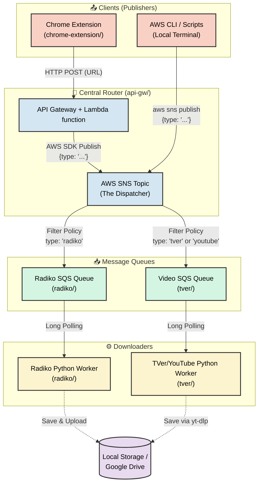

# Serverless Media Downloader ([日本語](./README_ja.md))

This repository contains an automated, event-driven media recording system designed to download streaming media (such as Radiko radio programs and TVer/YouTube videos), stitch them together if necessary, and ultimately save them locally or upload them securely to Google Drive.

It is structured as a monorepo housing several interconnected components:

<details>
<summary><b>System Architecture Diagram</b></summary>



</details>

## 🗂️ Projects

* **[chrome-extension](./chrome-extension/)**: A Chrome extension that captures URLs from the browser and sends them to the API Gateway.
* **[api-gw](./api-gw/)**: An AWS API Gateway and Lambda function that validates incoming requests and dispatches them as JSON payloads to a central AWS SNS topic. It acts as the traffic router (e.g., routing `radiko.jp` URLs to the Radiko SQS queue, and `tver.jp` or `youtube.com` URLs to the TVer/Video SQS queue).
* **[radiko](./radiko/)**: A Dockerized Python worker that continuously polls its dedicated SQS queue for Radiko URLs. It uses `yt-dlp` to download the segments, `ffmpeg` to concatenate them seamlessly, and the Google Drive API to upload the final `.m4a` file.
* **[tver](./tver/)**: A lightweight Dockerized Python worker that polls its SQS queue for Video (TVer/YouTube) URLs, using `yt-dlp` to download the videos locally.

## ⚙️ General Requirements

To run this project, you need the following infrastructure and tools:
* **Docker & Docker Compose** (Host machine, e.g., Ubuntu/Linux)
* **Terraform** (To automatically provision the required AWS infrastructure)
* **AWS Account** (For SNS Topics, SQS Queues, and IAM Users)
* **Google Account** (Destination for saving Radiko audio files. You can skip this and save locally. A **Google Workspace** account is recommended for avoiding 7-day token expirations.)
*   **Docker & Docker Compose** (Host machine, e.g., Ubuntu/Linux)
*   **Terraform** (To automatically provision the required AWS infrastructure)
*   **AWS Account** (For SNS Topics, SQS Queues, and IAM Users)
*   **Google Account** (Destination for saving Radiko audio files. You can skip this and save locally. A **Google Workspace** account is recommended for avoiding 7-day token expirations.)
*   **AWS CLI v2** (For sending manual recording requests from the host machine)

---

## 🚀 Setup Instructions

### 1. Provision AWS Resources (Terraform)
This project uses Terraform to automate the creation of the required AWS SNS Topics, SQS Queues, and IAM Worker credentials.

Before running Terraform, you must create a centralized configuration file in the root directory:
```bash
cp terraform.tfvars.example terraform.tfvars
```
Edit the newly created `terraform.tfvars` file and update all missing values like `aws_region`, your custom `secret_token`, and the `sns_topic_arn` (which you will get after deploying `api-gw`).

Next, you will need to run Terraform in three separate directories, in this specific order:

1.  **API Gateway (`api-gw/`)**: Creates the main SNS dispatcher topic and publisher credentials.
2.  **Radiko (`radiko/`)**: Creates the Radiko SQS queue and worker credentials.
3.  **TVer (`tver/`)**: Creates the TVer/Video SQS queue and worker credentials.

For each directory:
```bash
cd [directory]
terraform init
terraform plan -var-file="../terraform.tfvars"
terraform apply -var-file="../terraform.tfvars"
cd ..
```

Terraform will output the necessary IAM access keys, SQS Queue URLs, and the SNS Topic ARN. Keep these values handy for the `.env` file configuration in Step 3.

### 2. Google Drive API Configuration (Radiko Only)
If you do **not** configure Google Drive (by leaving `GDRIVE_FOLDER_ID` empty in step 3), the Radiko worker will automatically skip uploading and instead save the final `.m4a` files locally to your host machine's `/tmp` directory.

If you want to use Google Drive:
1. Go to the Google Cloud Console and enable the **Google Drive API**.
2. Create an **OAuth Consent Screen** (Internal for Workspace users, External for regular users).
3. Create **OAuth Client ID** credentials (Desktop App) and download the JSON.
4. Run the local authentication script to generate your `token.json` file. Place `token.json` in the `radiko/` folder. *(Note: Do not include `client_secret.json` in the runtime environment).*

### 3. Configure Docker Environment Variables
You must create a `.env` file in **both** the `radiko/` and `tver/` directories. Start by copying the examples:

```bash
cp radiko/.env.example radiko/.env
cp tver/.env.example tver/.env
```

Edit both `.env` files and fill in your newly provisioned AWS credentials, SQS Queue URLs, and Google Drive folder ID (if applicable).

### 4. Deploy the Workers
You can start the workers independently by navigating to their directories:

**Radiko Worker:**
```bash
cd radiko
docker compose up -d --build
```

**Video (TVer/YouTube) Worker:**
```bash
cd ../tver
docker compose up -d --build
```
The containers will now run silently in the background, polling their respective SQS queues for recording tasks.

### 5. Trigger a Recording
While the primary method of dispatching URLs is via the Chrome extension interfacing with the API Gateway, you can still trigger recordings manually using the AWS CLI.

Configure a new local AWS profile using the `publisher` access keys provided by the `api-gw` Terraform output:
```bash
aws configure --profile media-downloader-publisher
```

**Radiko Example:**
```bash
aws sns publish \
  --profile media-downloader-publisher \
  --topic-arn "arn:aws:sns:us-west-2:123456789012:media-downloader-dispatcher" \
  --message "{\"type\": \"radiko\", \"station_id\": \"FMJ\", \"start_times\": [\"202602221300\", \"202602221400\"], \"description\": \"JUNK伊集院\"}"
```

**Video (TVer/YouTube) Example:**
```bash
aws sns publish \
  --profile media-downloader-publisher \
  --topic-arn "arn:aws:sns:us-west-2:123456789012:media-downloader-dispatcher" \
  --message "{\"type\": \"tver\", \"url\": \"https://tver.jp/episodes/ex4mple\"}"
```

### 6. Scheduling Recordings (Cron)
For automatic, recurring recordings (like a weekly radio show), use your system's `crontab` to automatically publish messages via the `aws sns` CLI. See the `radiko` project documentation (if applicable) or construct standard cron jobs invoking the AWS CLI commands from Step 5.

---

## 🎛️ Environment Configuration

Both `radiko/.env` and `tver/.env` share a similar structure, providing robust configuration options:

| Variable | Required | Description |
| :--- | :---: | :--- |
| `AWS_ACCESS_KEY_ID` | Yes | The IAM access key for the specific downloader worker (from Terraform). |
| `AWS_SECRET_ACCESS_KEY`| Yes | The IAM secret key for the specific downloader worker. |
| `AWS_REGION` | No | Defaults to `ap-northeast-1`. |
| `SQS_QUEUE_URL` | Yes | The absolute URL of the SQS queue this worker should poll. |
| `GDRIVE_FOLDER_ID` | No | **(Radiko only)** ID of a Google Drive folder. If omitted, files are kept locally. |
| `DOWNLOAD_DIR` | No | The absolute path on your host machine to save media. Defaults to `/tmp`. |
| `PUID` / `PGID` | No | Your host machine's User and Group ID. Ensures downloaded files are owned by you instead of `root`. Find via `id -u` and `id -g`. |
| `YT_DLP_ARGS` | No | Global arguments injected into every `yt-dlp` execution. |
| `TZ` | No | Timezone for log timestamps. Defaults to `Asia/Tokyo`. |

### Advanced: `YT_DLP_ARGS`

You can use the `YT_DLP_ARGS` variable to apply critical `yt-dlp` global options (like concurrent connections, proxies, or premium credentials) seamlessly.

**Example: Radiko Premium User**
```env
YT_DLP_ARGS="-N 10 --extractor-args rajiko:premium_user=YOUR_USERNAME;premium_pass=YOUR_PASSWORD"
```

**Example: Video Resolution Capping (TVer/YouTube)**
```env
YT_DLP_ARGS="-N 10 -f 'bestvideo[height<=1080]+bestaudio/best'"
```
