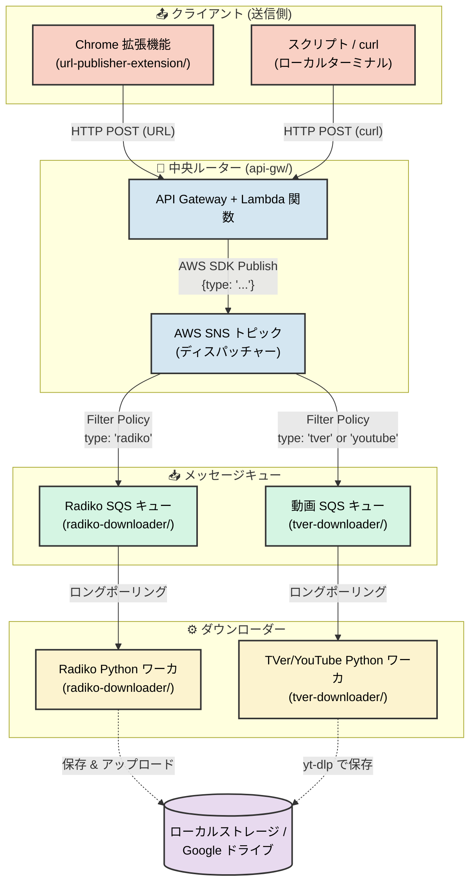

# サーバーレスメディアダウンローダー ([English](./README.md))

このリポジトリは、ストリーミングメディア（Radiko のラジオ番組や TVer・YouTube の動画など）をダウンロードし、必要に応じて結合し、最終的にローカルに保存するか Google ドライブへ安全にアップロードするための、自動化されたイベント駆動型の録画・録音システムです。

複数のコンポーネントが連携するモノレポ構成となっています：

<details>
<summary><b>システムアーキテクチャ図</b></summary>



</details>

## 🗂️ プロジェクト構成

* **[url-publisher-extension](./url-publisher-extension/)**: ブラウザから URL をキャプチャし、API ゲートウェイに送信する Chrome 拡張機能。
* **[api-gw](./api-gw/)**: 着信リクエストを検証し、中央の AWS SNS トピックへ JSON ペイロードとしてディスパッチする AWS API Gateway と Lambda 関数。トラフィックルーターとして機能します（例: `radiko.jp` URL は Radiko SQS キューへ、`tver.jp` や `youtube.com` URL は TVer/動画 SQS キューへルーティング）。
* **[radiko-downloader](./radiko-downloader/)**: Radiko 専用の SQS キューを継続的にポーリングする Docker 化された Python ワーカ。`yt-dlp` でセグメントをダウンロードし、`ffmpeg` でシームレスに結合し、Google ドライブ API で最終的な `.m4a` ファイルをアップロードします。
* **[tver-downloader](./tver-downloader/)**: TVer や YouTube 用の SQS キューを継続的にポーリングする軽量な Docker 化された Python ワーカ。`yt-dlp` を使用して動画をローカルにダウンロードします。

## ⚙️ 要件

このプロジェクトを実行するには、以下のインフラストラクチャとツールが必要です：
* **Docker & Docker Compose** (ホストマシン、例: Ubuntu/Linux)
* **Terraform** (必要な AWS インフラストラクチャを自動的にプロビジョニングするため)
* **AWS アカウント** (SNS トピック、SQS キュー、IAM ユーザー用)
* **Google アカウント** (Radiko のオーディオファイルの保存先用。ホストにローカル保存する場合は不要です。7日ごとのトークン有効期限切れを避けるため、**Google Workspace** アカウントを推奨します。)

---

## 🚀 セットアップ手順

### 1. AWS リソースのプロビジョニング (Terraform)
このプロジェクトは Terraform を使用して、必要な AWS SNS トピック、SQS キュー、および IAM ワーカの認証情報を自動的に作成します。

Terraform を実行する前に、ルートディレクトリに一元管理用の設定ファイルを作成する必要があります：
```bash
cp terraform.tfvars.example terraform.tfvars
```
新しく作成した `terraform.tfvars` ファイルを編集し、`aws_region` および `sns_topic_arn`（API Gateway をデプロイした後に取得します）を更新してください。

次に、以下の3つのディレクトリで、**この順番通り**に Terraform を実行する必要があります：

1. **API Gateway (`api-gw/`)**: メインの SNS ディスパッチャートピックとパブリッシャー（発行者）認証情報を作成します。
2. **Radiko (`radiko-downloader/`)**: Radiko 用 SQS キューとワーカ認証情報を作成します。
3. **TVer (`tver-downloader/`)**: 動画（TVer/YouTube）用 SQS キューとワーカ認証情報を作成します。

各ディレクトリで以下のコマンドを実行します：
```bash
cd [ディレクトリ名]
terraform init
terraform plan -var-file="../terraform.tfvars"
terraform apply -var-file="../terraform.tfvars"
cd ..
```

Terraform の実行が完了すると、必要な IAM アクセスキー、SQS キューの URL、および SNS トピックの ARN が出力されます。これらの値は、手順 3 の `.env` ファイル設定で使用するため控えておいてください。

> [!NOTE]
> `AWS_SECRET_ACCESS_KEY` などの出力がコンソール上で `<sensitive>` として隠されている場合、以下のコマンドを実行することで正確な値を表示できます：
> ```bash
> terraform output -json
> ```

### 2. Google Drive API の設定 (Radiko のみ)
Google Drive を設定しない場合 (手順3で `GDRIVE_FOLDER_ID` を空のままにした場合)、Radiko ワーカはアップロードを自動的にスキップし、代わりにホストマシンの `/tmp` ディレクトリに最終的な `.m4a` ファイルをローカル保存します。

Google Drive を使用したい場合：
1. Google Cloud Console にアクセスし、**Google Drive API** を有効にします。
2. **OAuth 同意画面** を作成します (Workspace ユーザーは内部(Internal)、一般ユーザーは外部(External)に設定)。
3. **OAuth クライアント ID** の認証情報 (デスクトップアプリ) を作成し、JSON をダウンロードします。
4. ローカルの認証スクリプトを実行して `token.json` ファイルを生成し、`radiko/` フォルダ内に配置します。*(注: `client_secret.json` は実行環境には含めないでください)。*

### 3. Docker 環境変数の設定
`radiko-downloader/` および `tver-downloader/` ディレクトリの**それぞれ**に `.env` ファイルを作成する必要があります。まずは example ファイルをコピーします：

```bash
cp radiko-downloader/.env.example radiko-downloader/.env
cp tver-downloader/.env.example tver-downloader/.env
```

2つの `.env` ファイルをそれぞれ編集し、新しくプロビジョニングした AWS 認証情報、該当する SQS キュー URL、および Google Drive フォルダ ID (該当する場合) を入力します。

#### ポストプロセス（後処理）フック (オプション)
ダウンロード終了後に外部スクリプトをトリガーしたい場合は、各 `.env` ファイルで `CREATE_READY_FILE=true` と設定してください。これにより、ワーカはメディアファイルの処理と `chown` 権限付与が完了した直後に、`/app/downloads` ディレクトリ内に `<media_file_name>.ready` という空のマーカーファイルを生成します。

<details>
<summary><b>例: Debian Systemd ウォッチャー</b></summary>

Debian / Ubuntu ホスト上で `inotify-tools` を使用してダウンロードディレクトリを監視し、`.ready` ファイルが作成された瞬間にカスタム処理 (ファイルの移動、Plex スキャンなど) をトリガーする軽量なバックグラウンドサービスを構築できます。

**1. `inotify-tools` のインストール:**
```bash
sudo apt update && sudo apt install -y inotify-tools
```

**2. プロセッサスクリプトの作成 (`/usr/local/bin/process_downloads.sh`):**
```bash
#!/bin/bash
DOWNLOAD_DIR="/path/to/media-downloader/downloads"

inotifywait -m -e create --format '%w%f' "$DOWNLOAD_DIR" | while read NEW_FILE
do
    if [[ "$NEW_FILE" == *.ready ]]; then
        MEDIA_FILE="${NEW_FILE%.ready}"
        if [ -f "$MEDIA_FILE" ]; then
            echo "[$(date)] 処理中: $MEDIA_FILE"
            
            # --- ここにカスタムコマンドを追加します ---
            # 例: mv "$MEDIA_FILE" /mnt/nas/
            
            rm -f "$NEW_FILE"
        fi
    fi
done
```
*(実行権限を付与します: `sudo chmod +x /usr/local/bin/process_downloads.sh`)*

**3. Systemd サービスの作成 (`/etc/systemd/system/media-processor.service`):**
```ini
[Unit]
Description=Media Downloader Ready File Processor

[Service]
Type=simple
User=your_linux_username
ExecStart=/usr/local/bin/process_downloads.sh
Restart=on-failure
RestartSec=5

[Install]
WantedBy=multi-user.target
```

有効化して開始するには: `sudo systemctl daemon-reload && sudo systemctl enable --now media-processor`
</details>

### 4. ワーカのデプロイ
それぞれのディレクトリに移動して、ワーカを個別に開始できます：

**Radiko ワーカ:**
```bash
cd radiko-downloader
docker compose up -d --build
```

**動画 (TVer/YouTube) ワーカ:**
```bash
cd ../tver-downloader
docker compose up -d --build
```
これでコンテナはバックグラウンドで静かに動作し、それぞれの SQS キューに録画・録音タスクが届くのを待機します。

### 5. Chrome 拡張機能のデプロイと設定
同梱されている Chrome 拡張機能は、メディアの URL をすばやく取得して配信するための主要な方法です。

> **💡 メモ:** この拡張機能は、汎用的な HTTP POST クライアントとして設計されています。このプロジェクトのディスパッチャー向けに構築されていますが、`x-api-key` ヘッダーと JSON (`{"urls": ["..."]}`) フォーマットを受け付ける**任意の** API Gateway や Webhook に向けて URL をパブリッシュすることも可能です。

Chrome ウェブストアには公開されていないため、ローカルで読み込む必要があります。

**インストール:**
1. Google Chrome を開きます。
2. アドレスバーに `chrome://extensions/` と入力して拡張機能ページに移動します。
3. 右上の **デベロッパー モード** のトグルをオンにします。
4. 左上の **パッケージ化されていない拡張機能を読み込む** ボタンをクリックします。
5. このプロジェクトディレクトリ内にある `url-publisher-extension` フォルダを選択します。
6. 「URL Publisher」拡張機能が表示されるはずです。アクセスしやすいようにツールバーに固定（ピン留め）してください。

**設定:**
URL を配信（パブリッシュ）する前に、拡張機能が AWS バックエンドと通信できるように設定する必要があります。
1. Chrome ツールバーの URL Publisher 拡張機能アイコンをクリックします。
2. 拡張機能ポップアップの右上にある **⚙️ 設定（Settings）** 歯車アイコンをクリックします。
3. 手順 1 の `api-gw` Terraform デプロイ時の出力結果を使用して、以下のフィールドに入力します：
   - **API Gateway Endpoint URL**: `api_endpoint` の URL を貼り付けます。
   - **API Key**: `api_key` の文字列を貼り付けます。
4. **Save Settings（設定を保存）** をクリックします。
5. これで準備完了です！サポートされている動画/ラジオのページに移動し、拡張機能を開いて **Publish（配信）** をクリックしてください。

### 6. タスクのトリガーとスケジューリング (HTTP API)
URL を配信する主要な方法は Chrome 拡張機能経由で API ゲートウェイにリクエストを送ることですが、標準的な HTTP POST リクエストを使用して、タスクを手動でトリガーしたり `cron` でスケジュールしたりすることも可能です。

`api-gw` の Terraform 出力から 2 つの値が必要です：
1. `api_endpoint` (Terraform 出力)
2. `api_key` (Terraform 出力)

**手動トリガー (Radiko の例):**
```bash
curl -X POST "https://YOUR_API_ENDPOINT/prod/publish" \
  -H "Content-Type: application/json" \
  -H "x-api-key: YOUR_API_KEY" \
  -d '{"urls": ["https://radiko.jp/#!/ts/FMJ/20260301130000"]}'
```

**手動トリガー (TVer の例):**
```bash
curl -X POST "https://YOUR_API_ENDPOINT/prod/publish" \
  -H "Content-Type: application/json" \
  -H "x-api-key: YOUR_API_KEY" \
  -d '{"urls": ["https://tver.jp/episodes/ex4mple"]}'
```

#### Cron による自動化
ラジオのレギュラー番組のように、定期的な自動録画・録音をおこなうには、上記の `curl` コマンドをそのままシステムの `crontab` に追加するだけです。

**Cron ジョブの例 (毎週日曜日の 12:55 に実行):**
```bash
55 12 * * 0 curl -X POST "https://YOUR_API_ENDPOINT/prod/publish" \
  -H "Content-Type: application/json" \
  -H "x-api-key: YOUR_API_KEY" \
  -d '{"urls": ["https://radiko.jp/#!/ts/FMJ/20260301130000"]}' >> /tmp/radiko-cron.log 2>&1
```

---

## 🎛️ 環境変数の設定

`radiko/.env` と `tver/.env` は同様の構造を持ち、堅牢な設定オプションを提供します。

| 変数名 | 必須 | 説明 |
| :--- | :---: | :--- |
| `AWS_ACCESS_KEY_ID` | はい | 特定のダウンローダーワーカ用の IAM アクセスキー（Terraformで作成）。 |
| `AWS_SECRET_ACCESS_KEY`| はい | 特定のダウンローダーワーカ用の IAM シークレットキー。 |
| `AWS_REGION` | いいえ | デフォルトは `ap-northeast-1` です。 |
| `SQS_QUEUE_URL` | はい | このワーカがポーリングする SQS キューの絶対 URL。 |
| `GDRIVE_FOLDER_ID` | いいえ | **(Radikoのみ)** Google ドライブのフォルダID。省略した場合、ファイルはローカルに保持されます。 |
| `DOWNLOAD_DIR` | いいえ | メディアを保存するホストマシン上の絶対パス。デフォルトは `/tmp` です。 |
| `PUID` / `PGID` | いいえ | ホストマシンのユーザーおよびグループID。ダウンロードしたファイルが `root` ではなくあなたの所有になるよう調整します。`id -u` と `id -g` で確認できます。 |
| `YT_DLP_ARGS` | いいえ | すべての `yt-dlp` 実行に注入されるグローバルな引数。 |
| `TZ` | いいえ | ログのタイムスタンプ用タイムゾーン。デフォルトは `Asia/Tokyo` です。 |

### 高度な設定: `YT_DLP_ARGS`

`YT_DLP_ARGS` 変数を使用すると、`yt-dlp` の重要なグローバルオプション（同時接続、プロキシ、プレミアムアカウントの認証情報など）をシームレスに適用できます。

**例: Radiko プレミアムユーザー**
```env
YT_DLP_ARGS="-N 10 --extractor-args rajiko:premium_user=YOUR_USERNAME;premium_pass=YOUR_PASSWORD"
```

**例: 動画の解像度制限 (TVer/YouTube)**
```env
YT_DLP_ARGS="-N 10 -f 'bestvideo[height<=1080]+bestaudio/best'"
```
