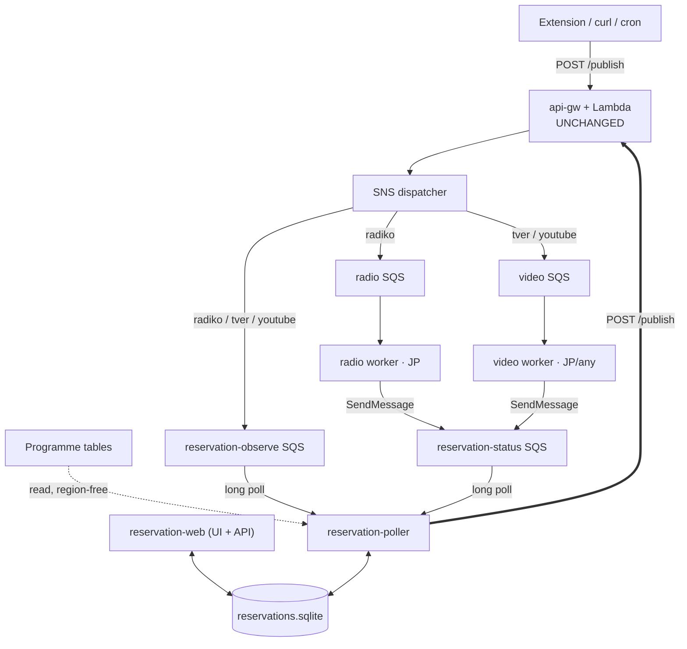

# Scheduling & Reservation — Design

Status: **proposal**, not yet implemented. Revision 5.
Researched and written 2026-09-04. All API observations were verified live on
that date.

**Terminology.** The cron origin made this look like *scheduling*, but the thing
being built is 予約録画 — a **reservation**. You reserve a programme; the system
decides when to fetch it. "Schedule" from here on means only the old crontab.
The service is the **reservation service** (one container, `reservation`),
never "the scheduler"; its polling loop is **the poller**.

Revision 5 drops the Postgres container (§5.1): the workload is ~3 MB after a
decade and 96 write bursts a day, so state is a **SQLite file** and the control
plane collapses to **one container** — with the schema kept dialect-portable so
Postgres stays a swap rather than a rewrite.

Revision 4 corrected the transport (§4.3): worker status travels by
`sqs:SendMessage` to a dedicated queue, **not** through SNS, because publishing
to the dispatcher topic would let the least-trusted component in the system
cause downloads.

Revision 3 responded to seven review points: `force` is one-shot and never
reservable (§2.5); Radiko programmes split into **differently-titled parts**
(§3.1, §5.2); TVer series carry **multiple seasons and live entries** (§3.3);
the `region` field is dropped (§4.2); the **dispatcher fans out to the
reservation service** so it observes every download (§4.1); the data model is
now programme → episode → part (§5); and both inbound links are **SQS**, on two
queues with different trust levels, so no component ever needs an inbound
connection to the control-plane host (§4.3).

---

## 1. The problem

Today a recurring recording is a `crontab` line:

```text
10 01 * * 0 d=$(TZ=Asia/Tokyo date -d 'today' -I | tr -d '-') && ~/bin/radiko-download.py \
  --station FMJ --desc "TOKIO HOT 100" ${d}130000 ${d}140000 ${d}150000 ${d}160000 \
  >> ~/logs/radiko-download.log 2>&1
```

That line works, and it should keep working. But it encodes a *wall-clock
schedule*, not a *programme*, and everything wrong with it follows from that:

| # | Problem | Consequence |
| - | ------- | ----------- |
| 1 | The hour is hard-coded | The broadcaster moves the show; cron silently records the wrong hour, or a 拡大版 gets truncated. Nothing reports it. |
| 2 | Multi-hour shows are hand-enumerated | `${d}130000 ${d}140000 …`. Add an hour to the show and you must edit the crontab. |
| 3 | A missed firing is lost | Host asleep at 01:10 Sunday → no recording, even though Radiko timefree keeps the programme for another 7 days. |
| 4 | **The schedule is decided before broadcast** | The crontab commits to 13:00–17:00 the moment it is written. Radiko corrects its table *after* the fact — a show that ran long, a 特番 that preempted it — and the frozen timestamps are then simply wrong. |
| 5 | No coverage for らじる★らじる | 聞き逃し has no timestamp addressing, so there is nothing for cron to construct. |
| 6 | No coverage for TVer | Episode URLs are unpredictable; they do not exist until the episode is posted. |
| 7 | Schedules live in one host's `crontab -e` | Unversioned, invisible, unreviewable, lost with the machine, and editable only over SSH. |
| 8 | `date -d` is a GNU-ism | Breaks on macOS/BSD hosts. |

Problem 4 is the one that matters most and the hardest to notice, because it
fails by producing a plausible file rather than an error.

The fix is to move from *scheduling* to *reserving* — 予約録画: the user declares
**what** they want recorded, and the system decides **when** to fetch it and
**which URL** that turns out to be — as late as it possibly can.

---

## 2. Four observations that shape the design

### 2.1 The reservation service is a publisher — and `url-publisher` stays a URL pusher

`api-gw` + the Chrome extension are a **general-purpose URL publisher**: give
them a URL, they classify it and drop it on SNS. That is worth protecting.

So the reservation service does not teach the Lambda about reservations. Its
only interaction with the dispatch path is the one a human already has: it
POSTs URLs to `/publish`.

> **What changes in `api-gw`: nothing.** No new route, no new URL class, no new
> Lambda logic. §4 achieves the review's fan-out with new *subscriptions* only.

### 2.2 Poll a window; never fire at an instant

Every reservable source is **on-demand with a multi-day availability window**:
Radiko timefree 7 days; らじる per-episode `expires`; TVer per-episode `endAt`.

So the poller never needs to fire at a precise moment. It wakes periodically,
asks *"which reserved episodes are now available and not yet fetched?"*, and
publishes those. Problem 3 disappears: a missed tick, a reboot, a week's
downtime are all recovered on the next scan. Catch-up is what the normal loop
does. It also gives **free bounded retry** — a failed fetch is simply not
marked done, and the window is the natural deadline.

### 2.3 Bind the episode URL as late as possible

A programme table is **mutable history**. Radiko revises entries after broadcast
when a show overran or a 特番 displaced it, so any URL derived from it has a
shelf life.

**Polling already fixes the worst of it.** Cron resolves *before* broadcast and
is always guessing; the poller resolves *after*, so the table it reads already
reflects what aired. **But that is not late enough**, because a published
message can sit in SQS behind other work, be redelivered after a visibility
timeout, or wait for an offline worker. Hours can pass.

| Source | Late binding at download time |
| ------ | ----------------------------- |
| Radiko | **New.** The worker re-reads the station's programme XML, confirms each `ft` still carries the expected title, and re-derives the part set if boundaries moved (§4.6). |
| らじる | **Already.** `download_radiru` calls `resolve_radiru_url` at download time; nothing is frozen at publish. |
| TVer | **Not needed.** An episode id is immutable once posted. |

### 2.4 Observe every download, not just the reserved ones

*(From the review: "even when a request goes directly to a worker, the
dispatcher still pushes it to the reservation service for recording.")*

This is the right call and it is worth stating as a principle. The reservation
service subscribes to the same messages the workers receive, so its history
covers **every** download — the extension, curl, an old cron line, and its own
publishes alike.

The payoff is not bookkeeping. It is **dedup across the manual/automatic
boundary**: download an episode by hand today and the reservation that also
covers it will not fetch it again tomorrow, because they resolve to the same
ledger key (§5.4). Without observation those two paths cannot see each other.

> **The loop hazard, and the rule that removes it.** Fanning out to the
> reservation service means its own publishes come back to it. That is only a
> loop if observing causes publishing, so:
>
> **Observation writes history and nothing else.** A publish happens only from
> (a) a reservation matching on a poll tick, or (b) an explicit human action.
> No inbound message ever creates a reservation or triggers a publish.
>
> This is a design rule, not a filter policy, which is why it belongs here
> rather than in the Terraform. History rows upsert by ledger key, so the
> service seeing its own publish return costs one idempotent write. The
> transport that carries it — and the reason worker status does *not* travel
> the same way — is §4.3.

### 2.5 `force` is a human action, one-shot, never reservable

`force: true` deletes the existing file before re-fetching. That is a fine
thing for a person to ask for once and a terrible thing to put on a timer.

* **Reservations have no `force` field.** It is absent from the model (§5.3),
  not merely unset — so it cannot be enabled by editing a record.
* **The poller never sets it.** Re-recording is what the ledger exists to
  prevent.
* **An observed `force` message is recorded as a one-shot manual download and
  never replayed.** It updates history so dedup stays correct, but it never
  creates or modifies a reservation, and the service never re-publishes it.
* **Re-queue from the UI republishes *without* `force`.** If a user genuinely
  wants to overwrite, that stays a deliberate publish through the normal path.

---

## 3. Source research

All sources were probed live on 2026-09-04. What follows is what came back.

### 3.1 Radiko — one episode is several differently-titled parts

`GET https://radiko.jp/v3/program/station/weekly/{STATION}.xml` — verified for
`FMJ`: HTTP 200, 758 KB, `<ttl>1800</ttl>`, `<date>` groups spanning
**20260828 → 20260910** — seven days back and six forward. One request covers
both the timefree window and upcoming programmes.

The review asked how the new design handles TOKIO HOT 100, which is four parts
with different titles. Here is what the table actually says, two consecutive
Sundays:

```text
20260906120000 -> 20260906130000  dur=3600  ADEKA KLEINE WUNDER
20260906130000 -> 20260906140000  dur=3600  SAISON CARD TOKIO HOT 100(PART1)
20260906140000 -> 20260906150000  dur=3600  SAISON CARD TOKIO HOT 100(PART2)
20260906150000 -> 20260906160000  dur=3600  SAISON CARD TOKIO HOT 100(PART3)
20260906160000 -> 20260906170000  dur=3600  SAISON CARD TOKIO HOT 100(PART4)
20260906170000 -> 20260906180000  dur=3600  OTSUKA CORPORATION SAUDE! SAUDADE…
```

Three things fall out of this, and together they answer the question:

1. **The parts share a stem and differ only by suffix.** A substring match on
   `TOKIO HOT 100` returns all four and nothing else. No per-part configuration
   is needed.
2. **The parts are contiguous** — each `to` equals the next `ft`. That is the
   grouping rule (§5.2): a maximal contiguous run of matching parts *is* one
   episode. The count is **discovered, not configured**, so a 拡大版 that adds a
   `PART5` is picked up automatically. This is problem 2 from §1 solved
   properly rather than by editing a crontab.
3. **The sponsor is in the title.** `SAISON CARD …` is a naming risk, not an
   observed change: sponsor prefixes on Japanese radio rotate with the
   sales cycle, and a match anchored on the full title would break silently
   when it does. The UI should steer users toward the distinctive core of a
   title (`TOKIO HOT 100`), and §7's heartbeat catches it if one slips through.

Publishing is unchanged: all four `ft` values go in **one** request, the Lambda
groups them by station into one SQS message, and `record_radiko` concatenates
them with ffmpeg exactly as it does today. **The existing multi-part path is
reused verbatim** — the reservation service only replaces the shell arithmetic
that enumerated the hours by hand.

For the filename, the reservation's `description` wins (it is what the user
typed). Where none is set, strip a trailing `(PART\d+)` / `（PART\d+）` from the
first part's title rather than using it raw.

Also verified 200: `/v3/station/list/{AREA}.xml`, and
`/v3/program/station/date/{YYYYMMDD}/{STATION}.xml` — already used by
`_fetch_radiko_title`, and the natural endpoint for the §4.6 check since it is
one day rather than fourteen. `/v3/api/program/search` returned **415** on every
shape tried; treat it as unavailable.

> **Day boundary.** Radiko's broadcast day runs 05:00–29:00. A "Sunday 25:00"
> programme sits in the `<date>20260906</date>` group with `ft=20260907010000`.
> Match on `<date>` + `ftl`; compute availability from `to`.
>
> **Resolution is not authorisation.** The programme XML answers fine from
> outside Japan — this research was done from a US host. Only the *download*
> needs regional access.

### 3.2 らじる★らじる — the missing piece

`https://www.nhk.or.jp/radio/config/config_web.xml` (200) advertises
`//api.nhk.jp/r8/pg/date/{service}/{area}/[YYYY-MM-DD].json`. Against
`area=130`: `r1` and `r3` return 200; `r2`, `fm`, `n1` return 400 — only two
services exist, agreeing with `_RADIRU_STATION_PATTERNS` having no `NHKR2`.
Date horizon: 200 from `2026-08-20` to `2026-09-11`. Roughly −15/+7 days.

**Finding 1 — the canonical URL is handed to you.** Each entry's
`about.canonical` is exactly the URL the worker already handles:
`https://www.nhk.jp/p/rs/242V3Q87GK/episode/re/K65RLNYQZ7/`.

**Finding 2 — a three-state availability signal, published ahead of
broadcast.** `about.audio[].detailedContentStatus.contentStatus`:

| State | Meaning |
| ----- | ------- |
| `about.audio` absent/empty | Never going to 聞き逃し. Do not let a reservation match it. |
| `contentStatus: "notyet"` | Announced, not yet fetchable — and `expires` is *already populated*. Keep polling. |
| `contentStatus: "ready"` | Fetch it now. |

Measured on the r3/130 listing for **2026-09-05, a future date** (fetched
09-04): 41 programmes, 30 with an `audio` entry, some already `ready`:

```text
音楽の泉 シューマンのピアノ協奏曲   listed 09-05 05:00  notyet  expires 2026-09-12
みんなのうた「ぼくのプルー」        listed 09-05 05:50  ready   expires 2026-10-03
マイあさ！ ▽ＮＨＫけさのニュース     listed 09-05 07:00  notyet  expires 2026-09-12
```

So a reservation can be **validated before the programme airs**. And the
already-`ready` rows are **rebroadcasts**: both みんなのうた entries are listed on
09-05 but their `broadcastEventId` is `r3-130-2026080175223` — the 1 August
airing. The listing date and the asset's broadcast can differ, so the ledger
key must come from the episode id, never the listing date.

> **The one-week rule is wrong as a hard assumption.** Both windows appear in
> the same day's data: the `notyet` rows expire 7 days after broadcast, the
> みんなのうた rebroadcasts run to 2026-10-03 — about two months. Read `expires`.

### 3.3 TVer — yes, and a series is messier than it looks

*(From the review: "TVer has a programme page like
`https://tver.jp/series/srusndh59f`. Are you able to parse and pick new
episodes?")*

**Yes.** Verified against that exact series on 2026-09-04:

```
POST /v2/api/platform_users/browser/create   → { platform_uid, platform_token }
GET  /service/api/v1/callSeriesSeasons/srusndh59f  → 5 seasons
GET  /service/api/v1/callSeasonEpisodes/{seasonID} → 18 entries total
```

But "follow the series" is the wrong unit, and the real data shows why:

```text
srusndh59f  Ｔシャツが乾くまで
  ss8ehuif2y  本編            3 entries   第９話, 第１話, + one live entry
  ssg4in0trk  サイドストーリー  3 entries   7.5話, 3.5話, 1.5話
  ssk9uny8nr  ダイジェスト      4 entries   10-minute digests
  ss6brvx81f  解説放送版        2 entries   【解説放送版】第９話, 第１話
  ssk3orcahd  ナビ・予告        6 entries   30-second trailers, ティザー
```

Three findings that change the design:

1. **Reserve a (series, season), not a series.** A naive series follow would
   fetch 10-minute digests, 30-second trailers, and 解説放送版 — which is the
   *same episode again* with audio description. Default to 本編; show the
   season list with episode counts and let the user opt into the rest.
2. **`callSeasonEpisodes` returns a mixed list.** Of the 18 entries, 17 are
   `type: "episode"` and one is `type: "live"` — a DVR/simulcast entry for
   第１０話 with `startAt`/`onairStartAt`, **no `isAvailable`, and no VOD
   `endAt`**. A resolver must filter on `type == "episode"` first. The probe
   script written for this research crashed on exactly that
   (`KeyError: 'isAvailable'`), which makes it a test case rather than a
   footnote.
3. **Windows are per-episode.** 第９話 ends 2026-09-11; 第１話 ends 2026-10-16.
   Read `endAt` per entry; never assume seven days.

```jsonc
{ "type": "episode",
  "content": { "id": "epliwk4kpb",        // → tver.jp/episodes/epliwk4kpb
    "seriesID": "srusndh59f", "seriesTitle": "Ｔシャツが乾くまで",
    "title": "第９話 言えなかったこと", "broadcastDateLabel": "9月4日(金)放送分",
    "duration": 2656, "isAvailable": true, "endAt": 1789131599 } }
```

> The `platform_uid`/`platform_token` pair is anonymous and cheap to mint, but
> undocumented and unversioned. Treat 4xx as *"re-mint once, then back off"*,
> and keep the TVer resolver isolated so a breakage cannot take the poller down.

### 3.4 YouTube — explicitly unchanged

YouTube is **not a reservable source**, and must keep working exactly as it
does today: the Lambda routes `youtube.com`/`youtu.be` to `{type: 'youtube'}`;
the video queue filters `type = ["tver", "youtube"]` with
`filter_policy_scope = "MessageBody"`; `record_video` is source-agnostic and
honours `force`.

Three commitments:

1. **No resolver claims a YouTube URL.** One reaching `/publish` came from a
   human.
2. **No message field changes.** Revision 2's `region` field is dropped (§4.2),
   and status travels off-topic entirely (§4.3), so a YouTube message on the
   dispatcher topic is byte-identical to today's.
3. **`force` still works** — and per §2.5 it stays a human, one-shot action.

> If YouTube ever should be reservable, it is the easiest of the four: every
> channel publishes `youtube.com/feeds/videos.xml?channel_id=…`, a plain RSS
> feed that slots into the same catalogue abstraction (§4.7). Not built now.

### 3.5 What each source can be reserved by

| Source | Reserve by | Availability | Expiry | Parts per episode |
| ------ | ---------- | ------------ | ------ | --- |
| Radiko | station + title match | `to` < now − grace | `ft` + 7 days | **1..n**, contiguous |
| らじる | `radioSeriesId` | `contentStatus == "ready"` | `audio[].expires` | 1 |
| TVer | `seriesID` + `seasonID` | `type=="episode"` and `isAvailable` | `endAt` | 1 |
| YouTube | *not reservable* | — | — | — |

---

## 4. Architecture

### 4.1 One entry point, with fan-out to the reservation service

*(From the review: "How about all requests go to the api-gw, and the SNS
dispatcher pushes the request to the reservation service? Compare with your
plan.")*

**Adopt it.** It is better than revision 2's design, and the comparison is
worth being explicit about:

| | Rev 2 (own intake + status queue) | Review's proposal (fan-out) |
| --- | --- | --- |
| History covers manual downloads | ✗ — only what the poller published | ✓ **every** download |
| Dedup across manual/automatic | ✗ | ✓ (§2.4) |
| `api-gw` code changes | none | none |
| New infrastructure | 1 status queue | 2 queues + 1 subscription |
| Loop risk | none | real, removed by the §2.4 rule |
| Worker → service feedback | separate status queue | separate status queue (§4.3) |

The decisive column is the second: without observation, a hand-published
episode and a reserved one cannot see each other, and the ledger is only ever
half the truth. Revision 2's status queue survives unchanged alongside the new
observation queue; §4.3 explains why they stay separate.



### 4.2 No `region` field

*(From the review: "Workers are placed in the right region according to
download type. YouTube could be the only worker placed in both regions. A new
`region` field may not be required at this time." — agreed; revision 2's
proposal is withdrawn.)*

Regional need already follows from type, so **type-based routing is region
routing**, and nothing new is needed.

The single case that strains it is the one the review names: a video worker
outside Japan for YouTube, sharing the video queue with TVer. SQS delivers to
exactly one consumer, so the non-JP worker could win a TVer job it cannot
serve. If that day comes, the fix uses the mechanism already in place —
**split `youtube` onto its own queue** with `filter_policy = {type: ["youtube"]}`
and narrow the video queue to `["tver"]`. A Terraform change, no message field,
no Lambda change, nothing to migrate.

Recorded here so the trap is visible before someone deploys the second worker.

### 4.3 The transport: two queues, and no inbound connections

*(From the review: "How do you plan to establish the connection from dispatcher
to the reservation system? This is not a real-time system, so the communication
can be another SQS message — and the same for worker status, as workers could
run in different regions.")*

Agreed on both counts, and it is the only transport that survives §4.5's
distributed workers. Neither link is real-time: the dispatcher echo feeds a
ledger, and a status message updates a row. Minutes of lag cost nothing, and
**no component ever needs an inbound connection to the control-plane host** —
which is what makes a home-hosted control plane workable at all.

Revision 3 said workers would publish status *through SNS*. That was wrong, and
checking the Terraform shows why: a worker's IAM user today holds exactly

```hcl
Action = ["sqs:ReceiveMessage", "sqs:DeleteMessage", "sqs:GetQueueAttributes"]
Resource = aws_sqs_queue.radiko_queue.arn
```

Publishing to the dispatcher topic would require `sns:Publish` on it — and a
worker holding that could publish `{"type": "radiko", …}` and cause arbitrary
downloads. The worker is the **least-trusted component in the system**: it runs
yt-dlp against remote content, in a container, on a host that may not be the
user's. It should not be able to make the system fetch things.

So the two links use different mechanisms, and get their own queues:

| Queue | Fed by | Carries | Grant |
| ----- | ------ | ------- | ----- |
| `reservation-observe` | **SNS subscription** on the existing topic | every dispatched download (§2.4) | none — SNS writes via a queue policy |
| `reservation-status` | **Workers, `sqs:SendMessage`** | job outcomes | `sqs:SendMessage` on this one queue ARN |

Two queues rather than one, for a reason worth the extra Terraform: it makes a
**trust boundary** out of the transport. Anything arriving on
`reservation-observe` was delivered by SNS and is a faithful echo of what the
dispatcher routed. Anything on `reservation-status` was written by a worker and
is only a *claim* about an outcome. With a single shared queue a worker could
inject a message shaped like a dispatch echo and manufacture ledger entries;
with two, it cannot — the grant does not reach the other queue.

(One queue would work if the extra resource is unwanted. The cost is that the
service must then distinguish the two by content rather than by which queue
they arrived on, which is a weaker guarantee for no real saving.)

**Terraform delta**, all of it additive:

* Two `aws_sqs_queue` resources plus queue policies.
* One `aws_sns_topic_subscription` on `reservation-observe`, with
  `filter_policy = {type: ["radiko", "tver", "youtube"]}`,
  `filter_policy_scope = "MessageBody"`, `raw_message_delivery = true` — the
  same shape as the two subscriptions that already exist. Note `status` is
  **not** in this list any more: status never touches the topic.
* One statement added to each worker's existing IAM user policy:
  `sqs:SendMessage` on the `reservation-status` ARN. Nothing removed.
* An IAM user for the reservation service with `ReceiveMessage` /
  `DeleteMessage` on those two queues, and **nothing else** — notably no
  `sns:Publish`, because it publishes over HTTP (§4.4).

**Cross-region is a non-issue, and already proven.** An SQS queue lives in one
AWS region and is called from anywhere; that is exactly how a worker works
today, with `AWS_REGION` and `SQS_QUEUE_URL` pointing at the queue's region
regardless of where the container runs. A worker in Japan and one in Oregon
both just call the same regional endpoint. No replication, no multi-region
anything.

**Message shape** for status — small, and enough to close the loop:

```jsonc
{ "type": "status",
  "worker": "radiko-downloader",
  "worker_id": "jp-nuc-1",           // stable per deployment
  "key": "radiko:FMJ:20260906130000",// the ledger key (§5.4)
  "status": "succeeded",             // succeeded | failed | duplicate
  "attempt": 1,
  "title": "TOKIO HOT 100",
  "at": "2026-09-06T17:12:44+09:00" }
```

The worker can compute `key` from the message it was handed — the same
derivation the resolver uses — so no new correlation id has to be threaded
through the dispatch path.

**Consuming both.** The poller thread runs the two long-polls alongside its
tick, in threads; all three write the same SQLite file, which serialises them
(§5.1).
This is deliberately the same 20-second `WaitTimeSeconds` loop the workers
already use in `run_main`, so there is one polling pattern in the repo, not
three.

**At-least-once, unordered — so handling must not assume otherwise.** SQS
standard queues can redeliver and reorder, which means a `failed` from attempt
1 can arrive after a `succeeded` from attempt 2. Two rules cover it:

* **Status advances state monotonically.** `(key, attempt)` is the ordering
  handle; a status older than what the row already records is dropped. A
  terminal `succeeded` is never overwritten by a late `failed`.
* **Observation upserts by ledger key.** The service seeing an echo of its own
  publish, or the same echo twice, costs one idempotent write (§2.4).

**Failures are non-fatal, in the direction that matters.** A worker that cannot
reach the status queue logs and moves on — the download already succeeded, and
the consequence is only that the ledger row stays `published` until the expiry
warning (§7) fires. Conversely an unparseable message is logged and deleted
rather than left to redeliver forever; nothing on these queues is precious
enough to justify a stuck consumer, and a dropped status is recoverable while a
blocked queue is not.

### 4.4 Publishing: HTTP to `/publish`, not direct SNS

The poller POSTs to the existing endpoint, as a client: it **reuses the
Lambda's real logic** — Radiko start-time grouping, the らじる regex set,
`force` validation — instead of duplicating it in Python where it would drift;
it needs no `sns:Publish` at all; and it reuses the credential the cron helper
already uses. To `api-gw`, the poller is indistinguishable from a human with
curl.

### 4.5 Control plane on one host; workers anywhere

Regional access differs by source — らじる is JP-only in yt-dlp, Radiko needs
areafree, YouTube needs nothing — so workers are distributed and stateless,
while the reservation service is centralised and stateful:

| Container | Job |
| --------- | --- |
| `reservation` | Everything: UI + REST API (§6), the tick loop, and the two SQS consumers of §4.3, as threads in one process. State is one SQLite file on a mounted volume (§5.1). |

One container, in the same shape as the two workers that already exist.

Centralising the control plane works only because of the §3.1 finding:
**resolution is region-free** — the programme tables answer from anywhere, and
only the download needs regional access.

### 4.6 The Radiko late-binding check

The concrete form of §2.3, and the only worker change the design needs. The
published message gains one **optional** field:

```jsonc
{ "station_id": "FMJ",
  "start_times": ["202609061300","202609061400","202609061500","202609061600"],
  "description": "TOKIO HOT 100",
  "expect_title": "TOKIO HOT 100" }   // ← new, optional
```

When `expect_title` is present, `record_radiko` re-reads
`/v3/program/station/date/{date}/{station}.xml` before downloading and:

1. **Confirms** each `ft` still carries a matching title.
2. **Re-derives the contiguous part run** from the title if boundaries moved —
   the authoritative answer to "the show ran long" and "a 特番 shifted
   everything by an hour". Note this is the same grouping rule as §5.2, applied
   a second time and later.
3. **Fails loudly** if the title is gone, rather than recording whatever now
   occupies the slot.

Why this shape: **backward compatible** — without `expect_title`, every
hand-published message, every cron line and `radiko-download.py` behave
byte-for-byte as today; **it reuses code that exists** — the worker already
calls `_fetch_radiko_title` against this endpoint to name the file; and **it
makes the filename trustworthy** — the recording is named after a title
confirmed at download time, so a mismatch surfaces as a failure instead of a
plausible wrong file.

> **Not a re-resolve from scratch.** The worker trusts the reservation's intent
> — this station, this title, around this time — and re-derives only the part
> boundaries. It never searches the whole week, so a corrupted or hostile
> message cannot make it record something unrelated.

### 4.7 The one unifying abstraction

> A reservation is a **query over a source's catalogue**. On each tick the
> poller runs every query and publishes the episodes that are available,
> unexpired, and not already in the ledger.

Covers all three reservable sources with one loop — and would cover a YouTube
channel feed unchanged, if that is ever wanted.

```python
# Pure: no I/O, no clock of its own. Testable from a fixture.
def resolve(reservation, catalogue, now) -> list[Episode]: ...

@dataclass(frozen=True)
class Part:
    url: str                  # what gets published
    start: datetime
    end: datetime
    title: str                # the part's own title, e.g. "…(PART2)"

@dataclass(frozen=True)
class Episode:
    key: str                  # stable identity, see §5.4
    parts: tuple[Part, ...]   # 1 for らじる/TVer, 1..n for Radiko
    title: str                # the episode's name, part suffix stripped
    available: bool
    expires_at: datetime | None
```

I/O lives at the edges — one fetcher per source, one publisher, one store.
Resolvers stay pure functions of `(catalogue, now)`, which is what makes the
whole thing testable offline against recorded fixtures (§8).

---

## 5. Data model

*(From the review: "a programme could have multiple episodes, and an episode
could be multiple parts, for Radiko.")* Revision 2's flat ledger was wrong.
Three levels:

```
Programme (番組)      what you reserve.  1 row per reservation
   └─ Episode (回)    one airing.  the unit of dedup, and of one delivered file
        └─ Part       Radiko only.  contiguous <prog> segments, concatenated
```

| | Programme | Episode | Part |
| --- | --- | --- | --- |
| Radiko | station + title pattern | a contiguous run of matching parts | each `<prog>` (`ft`→`to`) |
| らじる | `radioSeriesId` | `radioEpisodeId` | — (always 1) |
| TVer | `seriesID` + `seasonID` | episode `id` | — (always 1) |

### 5.1 Storage: SQLite in the same container, not a database server

*(From the review: "How do you plan for Postgres? Can it be a lightweight
version running in a container along with the reservation system?")*

It can — `postgres:17-alpine` with `shared_buffers=16MB` and
`max_connections=20` idles around 30–50 MB and is a perfectly reasonable
container. But having sized the workload, **I do not think this should be a
database server at all.** Revision 4's Postgres was cargo-culted from "it has a
UI, so it needs a DBMS", and the numbers do not support it.

**How much data is there, actually?** A ledger row is a key (~40 B), a title
(~60 B), a part list (~60 B), a status and a few timestamps — call it 300 bytes.
Twenty weekly reservations produce `20 × 52 = 1,040` episodes a year:

| Horizon | Rows | Size |
| ------- | ---- | ---- |
| 1 year | ~1,000 | ~0.3 MB |
| 10 years | ~10,400 | **~3 MB** |

Three megabytes after a decade. Plus perhaps 100 reservation rows. That is not
a database-server workload; it is a file.

**And how much concurrency?** Four writers — the tick, the two SQS consumers
(§4.3), and the web app — none of them hot. A tick every 15 minutes is 96 write
bursts a day; status and observation messages arrive a handful of times a day.
SQLite in WAL mode serialises writers with a `busy_timeout`, and at this rate
two writers colliding is a once-in-a-long-while event that resolves in
milliseconds.

**What would actually justify Postgres** — and none of it is true here:

| Reason | Applies? |
| ------ | -------- |
| Writers on more than one host | No — the control plane is one host by §4.5 |
| Sustained concurrent writes | No — 96 bursts/day |
| Data beyond a laptop's RAM | No — 3 MB per decade |
| Queries needing a planner worth the name | No — lookups by key, lists by date |
| Replication, PITR, roles | No |

**So: SQLite, and the container split collapses too.** With no database server
to sit between them, `reservation-web` and `reservation-poller` have no reason
to be separate containers — and revision 4's justification for splitting them
("the UI must stay responsive while a tick pulls a 758 KB XML") does not hold
up: Python releases the GIL during I/O, so a thread doing an HTTP fetch does not
block a thread serving a request. One container, several threads, one file:

| Was (rev 4) | Now |
| ----------- | --- |
| `reservation-web` + `reservation-poller` + `postgres` | **`reservation`** — web, tick, and two SQS consumers as threads |
| Postgres volume + credentials + major-version upgrades | one `.sqlite` file on a mounted volume |

This also puts the new component in exactly the shape of the two that exist: a
single container with a `.env` and a volume. Three containers would have made
the reservation service the most complicated thing in a repo whose whole
character is small workers doing one job.

**Keep the schema portable anyway**, so Postgres stays a swap rather than a
rewrite. It costs nothing if the SQL avoids both dialects' specialities:

* **Natural primary keys** — the ledger key (§5.4) and the reservation id. No
  `AUTOINCREMENT` / `SERIAL` divergence, and it is the right modelling choice
  regardless.
* **Timestamps as ISO-8601 UTC text.** SQLite has no date type; ISO-8601 sorts
  correctly as a string and reads identically in both. (JST is derived for
  display, per §10's clock note.)
* **The selector stored as JSON in a TEXT column.** SQLite's JSON1 and
  Postgres's `jsonb` both read it; only the indexing differs, and there is
  nothing here worth indexing.
* **`INSERT … ON CONFLICT … DO UPDATE`** for the upserts of §2.4 — identical
  syntax in SQLite 3.24+ and Postgres 9.5+.

No ORM is needed to hold that line; a thin data-access module with plain SQL is
enough, and it keeps the dependency list as short as the workers'.

**Backup is now a one-liner**, which matters because reservations are the only
irreplaceable data (the ledger regenerates itself from the sources, at the cost
of some re-downloads):

```
sqlite3 reservations.sqlite "VACUUM INTO '/backup/reservations-$(date +%F).sqlite'"
```

`VACUUM INTO` is atomic and safe against a live database, so this runs on a
timer with nothing stopped. `GET /api/reservations` (§5.3) remains the
human-readable export for keeping reservations in git.

**Two constraints worth stating rather than discovering.** The database file
must live on a **local filesystem** — POSIX locking is unreliable over NFS and
SMB, so a NAS mount will corrupt it — and every writer must be on that host.
Both follow from §4.5 anyway, but they are the conditions under which this
choice is correct, and the moment either stops holding, the portable schema
above is the escape hatch.

**One new failure mode comes with the collapse.** In a single process an
unhandled exception kills a *thread*, not the process — so the tick could die
while the web app keeps cheerfully serving. Two mitigations: the tick loop
wraps each pass in `try/except` and sleeps, exactly as `run_main` already does;
and it records a `last_tick_at` that the UI shows and §7 alerts on. A
reservation service that has silently stopped polling is the same class of
failure as a reservation that has silently stopped matching, and it deserves
the same treatment.

### 5.2 How Radiko parts become an episode

The grouping rule, and the answer to the TOKIO HOT 100 question:

1. Within one station-day, select every `<prog>` whose title matches the
   reservation.
2. Group the matches into **maximal contiguous runs** — `prog[i].to ==
   prog[i+1].ft`.
3. Each run is **one episode**; its parts are the progs, in `ft` order.

Properties worth having:

* **The part count is discovered.** Four parts this week, five next week for a
  拡大版 — no configuration changes. Problem 2 of §1, gone.
* **Two airings the same day split correctly.** A rerun that is not adjacent to
  the original forms its own run, hence its own episode and its own file.
* **It degenerates correctly.** A single-part programme is a run of one.
* **The existing download path is untouched.** All part `ft`s go in one
  `/publish` request; the Lambda groups them by station into one SQS message;
  `record_radiko` concatenates with ffmpeg. This is exactly what the crontab
  produced by hand, minus the hand.

Episode title: the reservation's `description` if set, else the first part's
title with a trailing `(PART\d+)` / `（PART\d+）` stripped.

### 5.3 Reservations

A reservation is a small, exportable record — `GET /api/reservations` returns
the YAML-equivalent, so it can be kept in git alongside the code (§5.1).

```jsonc
{
  "id": "tokio-hot-100",
  "source": "radiko",             // radiko | radiru | tver
  "enabled": true,
  "selector": {
    "station": "FMJ",
    "match": { "title": "TOKIO HOT 100" },   // the distinctive core, §3.1
    "weekday": "sun"                          // optional guard against reruns
  },
  "description": "TOKIO HOT 100", // episode title / filename stem
  "once": false,
  "until": null
}
```

Selectors per source: **Radiko** — `station` + `match.title`, or `at` +
`duration` for a time block when titles are inconsistent. **らじる** —
`series`. **TVer** — `series` + `season` (§3.3; defaults to 本編).

There is **no `force` field**, by §2.5.

Matching defaults to **substring, case-insensitive, after NFKC normalisation** —
Japanese titles mix full- and half-width freely, and the TOKIO HOT 100 case
shows why substring rather than equality is the default. The trade-off belongs
in the UI, not hidden: too loose and you record 特番 you did not want; too
tight and you miss the 拡大版, or the week the sponsor prefix changed.

### 5.4 The ledger

One row per **episode**, keyed by a stable identity:

| Source | Ledger key |
| ------ | ---------- |
| Radiko | `radiko:{station}:{ft of first part}` |
| らじる | `radiru:{seriesId}:{episodeId}` |
| TVer | `tver:{episodeId}` |

Columns: `key`, `reservation_id` (**null for a manual download** — that is what
makes §2.4's cross-boundary dedup work), `title`, `parts` (the `ft` list, so a
boundary change is visible after the fact), `published_at`, `status`
(`published` / `succeeded` / `failed`), `manual_oneshot` (set for an observed
`force`, §2.5), `attempts`, `expires_at`, `worker`.

The key is derivable from a *published URL* as well as from a resolver, which
is precisely why observation (§2.4) yields dedup rather than just a log. The
workers' filename-based duplicate detection stays as a second line of defence,
so losing the ledger degrades to harmless re-downloads.

### 5.5 Publish payloads

Nothing new on the wire except the optional `expect_title` of §4.6.

```jsonc
// Radiko — one episode, four parts, one request, one SQS message,
// concatenated by the existing ffmpeg path in record_radiko().
{ "urls": [
    "https://radiko.jp/#!/ts/FMJ/20260906130000",
    "https://radiko.jp/#!/ts/FMJ/20260906140000",
    "https://radiko.jp/#!/ts/FMJ/20260906150000",
    "https://radiko.jp/#!/ts/FMJ/20260906160000"
  ],
  "description": "TOKIO HOT 100",
  "expect_title": "TOKIO HOT 100" }

// らじる — canonical episode URL; the worker resolves it fresh at download
{ "urls": ["https://www.nhk.jp/p/rs/242V3Q87GK/episode/re/K65RLNYQZ7/"] }

// TVer
{ "urls": ["https://tver.jp/episodes/epliwk4kpb"] }
```

Never `force` (§2.5).

---

## 6. The UI

A `docker compose run` CLI is the wrong primary interface for something whose
core difficulty is *"will this actually match my show next Sunday?"*. That
question needs to be answered visually, against real programme data, before the
reservation is saved.

`reservation-web` serves a small web app:

**Reservations** — the home view. One row per reservation: source, what it
matches, when it last recorded, when it next expects to, and a health chip
(§7). Sorted so anything unhealthy floats up.

**Add by browsing, not by typing.** This is where the "the Radiko site has a
programme table" idea lands, but in our UI rather than by scraping theirs. Pick
a station and a day, get the real grid from `v3/program/station/weekly`, click
a programme, and the selector is pre-filled. For TVer the browser is a **season
picker** (§3.3) — five seasons with episode counts, 本編 preselected — because
that is the choice a user must actually make and would otherwise get wrong.

**Live preview, showing episodes and their parts.** Beside the match field, the
next 7 days of matches, updating as you type. Crucially it shows the *grouping*,
not just the hits, so a user can see that four rows became one episode:

```text
Sun 06 Sep   TOKIO HOT 100          4 parts  13:00–17:00   → 1 file
Sun 13 Sep   TOKIO HOT 100          4 parts  13:00–17:00   → 1 file
```

That single view is what makes §5.2 trustworthy: it makes the contiguity rule
visible, so a stray sponsor-prefix change or an accidental match shows up as
"5 parts" or "2 episodes" before anything is recorded. For らじる it also shows
`contentStatus` and `expires` per episode (§3.2).

**History** — the ledger, filterable, showing manual downloads alongside
reserved ones (§2.4) and the worker that reported each result, with a
one-click re-queue that republishes **without** `force` (§2.5).

**Workers** — last-seen and last-result per worker, from the status messages of
§4.3. With workers spread across regions this is the only place a user can see
that the JP host has been down since Tuesday.

Notes on shape:

* **Read-mostly, small data.** Server-rendered with a little JS is enough; this
  does not need a SPA build step in a repo that currently has none.
* **Auth.** It can trigger downloads and holds an API key, so it is not
  internet-facing by default: bind to LAN, put it behind Tailscale or a reverse
  proxy, require a token on the REST API. Say so in the README.
* **The CLI stays** for scripting and debugging (`preview`, `run --dry-run`,
  `backfill`), sharing the resolver library with the web app. It is just no
  longer what a person uses day to day.

The **Chrome extension is untouched** and stays a URL publisher (§2.1, §4.3).
The UI's own programme browser covers reserve-from-the-page without it.

---

## 7. Health, and the enemy of silent failure

A recorder that stops recording and says nothing is worse than one that
crashes. Three defences, surfaced as the health chip in §6:

1. **Heartbeat.** A reservation matching nothing for N consecutive expected
   occurrences (default 2) is marked unhealthy and notified. This catches the
   season ending, the sponsor prefix changing (§3.1), a TVer season being
   retired, and the programme API changing shape.
2. **Part-count drift.** A Radiko episode that resolves to a different number
   of parts than the reservation's recent history is *recorded but flagged*.
   Usually a 拡大版 — occasionally a match that has gone wrong. Cheap to
   compute from the `parts` column (§5.4) and it is the earliest visible sign
   of the failure mode §3.1 warns about.
3. **Expiry warning.** A ledger row still `published` or `failed` with
   `expires_at` inside 24 h escalates. Last chance to intervene by hand.
4. **Worker liveness.** No status message from a worker in N hours means jobs
   may be queueing for a host that is gone.

---

## 8. Testing

The existing suite is entirely offline, stubbing transports. Hold that line;
the pure-resolver split in §4.7 is what makes it possible.

* **Fixtures** — trimmed real responses captured during this research: the
  `FMJ` weekly XML **including the four `(PART1..4)` rows**, an
  `api.nhk.jp/r8/pg/date` day covering all three らじる states, and the
  `srusndh59f` season list plus its episode pages **including the `type:
  "live"` entry**.
* **Radiko part grouping (§5.2)** — the highest-value resolver tests. Four
  contiguous parts become one episode; a five-part 拡大版 becomes one episode
  without configuration; two non-adjacent airings become two episodes; a
  single-part programme still works; the `(PART\d+)` suffix is stripped from
  the episode title.
* **TVer season and entry filtering (§3.3)** — a season list yields only the
  reserved season; a `type: "live"` entry is skipped rather than crashing;
  per-episode `endAt` is honoured rather than assuming seven days. The probe
  script for this research crashed on the live entry, so this is a regression
  test for a real defect, not a hypothetical.
* **Late binding (§4.6)** — the path that prevents a wrong recording. A message
  whose `ft` still matches; one whose programme moved 30 minutes; one whose
  programme is gone. Assert re-derivation, and assert a clean failure rather
  than a wrong file.
* **`force` containment (§2.5)** — an observed `force` message writes history
  and creates no reservation; a re-queue publishes without `force`; a
  reservation record rejects a `force` key.
* **Observation and dedup (§2.4)** — a manual publish of an episode that a
  reservation also covers results in exactly one download; observing the
  service's own publish is idempotent; no inbound message ever causes an
  outbound publish.
* **YouTube non-regression (§3.4)** — the Lambda still routes
  `youtube.com`/`youtu.be` to `type: 'youtube'`, and the new reservation
  subscription does not change what the video queue receives.
* **Ledger** — same tick twice publishes once; restart mid-tick does not
  double-publish; a `failed` row retries until `expires_at` and then stops.
* **Contract canaries** — a small opt-in (`-m network`) suite hitting the three
  live APIs, asserting only the fields §3 depends on. Not in CI. API drift is
  the top operational risk in this repo — `ensure_yt_dlp_current` exists for
  exactly that reason.

---

## 9. Phasing

| Phase | Scope | Delivers |
| ----- | ----- | -------- |
| **0** | Resolver library + fixtures + `preview` CLI. Radiko only, including part grouping (§5.2). | Proof that TOKIO HOT 100 resolves to one episode of four parts, on real data, before anything can record. |
| **1** | `reservation` container + SQLite + ledger, publishing via `/publish`. Radiko only. Plus the §4.6 late-binding check in the radio worker. | **Replaces the crontab.** Fixes problems 1, 2, 3, 4, 7 and 8. |
| **2** | `reservation-web`: reservations, programme browser, live preview with part grouping, history. | The UI. Makes the feature usable by a person rather than by `crontab -e`. |
| **3** | The two queues of §4.3 + the SNS subscription; worker `SendMessage` grant and status emit; observation, cross-boundary dedup, health chips. | §2.4 — history covers every download, and distributed workers become observable. |
| **4** | らじる and TVer resolvers (season-aware). | Fixes problems 5 and 6. |

Phase 1 pays for the project. Phase 2 makes it pleasant. Phase 4 is what could
not be attempted at all before this research.

> **Compatibility.** `radiko-download.py`, the crontab recipe, `SCHEDULING.md`,
> the Chrome extension, `force`, and every YouTube/TVer publish keep working
> untouched. The reservation service is additive — a user can run one
> reservation and keep twelve cron lines.

---

## 10. Risks

| Risk | Likelihood | Mitigation |
| ---- | ---------- | ---------- |
| Title match too loose / too tight | High | Live preview showing part grouping (§6); `weekday` and `duration` guards; part-count drift alert (§7); §4.6 turns a mismatch into a failure instead of a wrong file. |
| Sponsor prefix changes in a Radiko title | Medium | Match the distinctive core, not the full title (§3.1). Heartbeat catches it within two occurrences. |
| Programme API changes shape → silent stop | Medium | Heartbeat (§7); contract canaries (§8); resolvers isolated so one breakage does not stop the others. |
| Radiko corrects the table between publish and download | Medium | §4.6 — exactly what it is for. |
| A TVer season is retired or renumbered mid-run | Medium | Reservation is (series, season); heartbeat fires when the season stops yielding episodes. |
| Observation causes a publish loop | Low but severe | Structural rule in §2.4: observation writes history only. Enforced by having no code path from the SQS consumer to the publisher. |
| A compromised worker triggers downloads | Low but severe | Workers get `sqs:SendMessage` on the status queue only — never `sns:Publish` (§4.3). A worker cannot make the system fetch anything. |
| A status message is lost or arrives out of order | Medium | Non-fatal by design: the row stays `published` and the expiry warning fires (§7). Status advances monotonically by `(key, attempt)`, so a late `failed` cannot overwrite a `succeeded` (§4.3). |
| A worker wins a job it cannot serve regionally | Low today | Type-based routing already separates regions (§4.2). Split `youtube` onto its own queue if a video worker is ever deployed outside Japan. |
| Control-plane host down | Medium | Only costs recordings if downtime exceeds the shortest window (~7 days). Workers keep draining their queues. |
| TVer `platform_uid` flow breaks | Medium | Undocumented API. Re-mint once, back off, disable that resolver only. |
| UI reachable from the internet | Low but severe | Not internet-facing by default; token on the REST API; documented in the README. |
| Database file lost or corrupted | Low | Degrades to re-downloads, not loss: the ledger regenerates from the sources. Reservations are the irreplaceable part — `VACUUM INTO` on a timer, plus the API export (§5.1). |
| SQLite on a NAS mount | Low but severe | POSIX locking is unreliable over NFS/SMB. Documented constraint (§5.1); the volume must be local. |
| The tick thread dies silently | Medium | `try/except` per pass, plus a `last_tick_at` surfaced in the UI and alerted on (§5.1, §7). |
| API GW quota (100/day, 2 rps, burst 5) | Low | Ticks do not call the API; only publishes do. Note that under §4.1 both manual and reserved publishes count. Cap publishes per tick. |
| Clock | — | Japan has no DST. Store aware datetimes; normalise to JST once, at the edge. |

---

## 11. Open questions

1. **Where does the late-binding check live long-term?** §4.6 puts it in the
   radio worker, which keeps the message a plain URL set. The alternative is a
   resolve step in the poller immediately before publish — simpler to test, but
   it re-opens the publish→download gap that §2.3 exists to close. Leaning
   worker-side.
2. **Reserve-from-the-browser: is a `reserve: true` passthrough acceptable?**
   §4.3 argues a URL alone cannot express *download now* vs *follow forever*,
   and that `nhk.jp/p/rs/<series>/` already means the former. A boolean of the
   same shape as `force` would resolve it without teaching the Lambda anything
   — but it is still a new field on the publish contract.
3. **Should a manual download satisfy a reservation, or only suppress it?**
   §5.4 makes them share a ledger key, so a hand-published episode suppresses
   the reserved fetch. That is almost certainly right, but it means a manual
   download at lower quality silently becomes *the* recording.
4. **Tick interval** — 15 min sits comfortably inside every window and costs
   ~100 API calls/day. Per-source, given TVer changes faster than a Radiko
   weekly table?
5. **What should `description` carry for らじる and TVer** — series name or
   episode name? Radiko's is settled by §5.2; the other two are not.

---

## 12. Out of scope

* **YouTube as a reservable source.** §3.4 records what must keep working and
  sketches the channel-RSS route if it is ever wanted.
* **Live recording.** Everything here is on-demand — including TVer's
  `type: "live"` entries, which §3.3 filters out. Radiko live and らじる
  simulcast are excluded, and §2.2 does not apply to them: they *would* need
  instant-accurate triggers.
* **Japanese translation.** The repo is bilingual, but this proposal will
  change during review and translating now means translating twice.
  `RESERVATION_DESIGN_ja.md` belongs with the Phase 1 user-facing docs.
* **Implementation.** No code beyond the interface sketches in §4.6 and §4.7.
